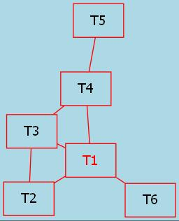

## Python Family Tree Generator

This is library for generating family trees in Python using graphviz. It allows you to create and visualize family trees with ease. The library supports various formats for output, including PDF, JPG, and more. You can customize the appearance of the tree, including node labels and colors. 

## Features
- Generate family trees in various formats (PDF, JPG, etc.)
- Support for different types of tree generations (e.g., normal, with ancestors, full , circle)
- Customizable node labels and colors
- See relationships between nodes (example: great great grandfather's first son's partner)

## Why
So, I have a telegram bot which kind of generates family trees for like 3 years now. I wanted to make it open source and I thought it would be a good idea to make a library for it. So, here we are. This is extracted version from my bot.
Also, The Family Tree lies between tree and graph, I tried to find solutions but I couldn't find any.
also, family tree + graphviz = family tree viz !
compared to pydot, it has slightly less overhead, hence better performance.


## Installation
```bash
pip install family-tree-viz
```

You need to install graphviz for your system.
Linux: Debian/Ubuntu:
```bash
sudo apt-get install graphviz
```
Fedora:
```bash
sudo dnf install graphviz
```
Windows:
Install from releases: [Graphviz releases](https://gitlab.com/graphviz/graphviz/-/releases)
then install and check it by typing

```bash
dot -V
```

## Usage

Sample Usage:
```python

import asyncio
from family_tree_generator import FamilyTreeGenerator, FamilyTreeMember, TreeType

async def main():

    t1 = FamilyTreeMember(1,label="T1")
    t2 = FamilyTreeMember(2,label="T2")
    t1.add_child(t2)
    generator = FamilyTreeGenerator()
    image = await generator.generate(t1,TreeType.QUICK)
    image.show()
    # if you want to save it
    image.save("family_tree.jpg")

asyncio.run(main())
```

this will generate a simple family tree with two members and display it.


Detailed Usage:

You can use multiple formats
``` python
  image = await generator.generate(t1,TreeType.QUICK,format="pdf")
```
jpg, pdf,svg,json & png are supported

You can save directly to file
``` python  
  image = await generator.generate(t1,TreeType.QUICK,format="pdf",output_path="family_tree.pdf")
```
it'll append extension if it's not there.


There are 4 types of trees you can generate:
- QUICK: find the root node of current tree and generate a tree with it as the root node. (Aka add from ancestors and descendants)
- FAMILY: current node is taken as root node and all children are added to it. (aka only show your family + descendants)
- FULL: Expand in all directions, cover all nods in connected tree. (Cover everyone in the family tree)
- CUSTOM: A customizable tree generation method that allows for more complex structures.
- FRIEND_CIRCLE: A tree generation method that represents a friend circle.

The friend circle looks like this:
``` python
  image = await generator.generate(t1,TreeType.FRIEND_CIRCLE)
```



You can also add images.
documentation soon.
You can also customize colors.
documentation soon.

You can also see relationship between nodes
Documentation soon.


